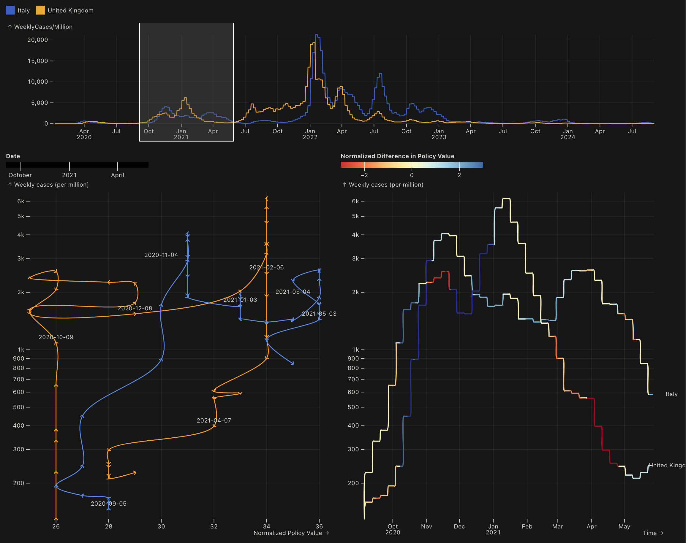

#### OxCGRT data analysios

With this first plot, we can have an overview of how different countries responded to COVID-19. With a window-size of 30, the color is the monthly difference in change of policies. Ideally, we would see darker blue when weekly infected cases takeoff, and light red when infected cases are going down (strong initial response, slow reopening). Needless to say that we see wide variation across countries. 

Another view of the same data is to remove the facetting, showing the variation in policy responses:

The second plot is meant to dive deeper into policy responses of either a single country or a pair of country, for a selected window of time:

Here we compare UK and Italy's responses during the second wave. In orange, we have the United Kingdom (see legend at the top left), who had had a delayed, but more intense second wave. Ideally, we would see a clockwise movement in the phase diagram. This is not what we are seeing. [TOFINISH]

