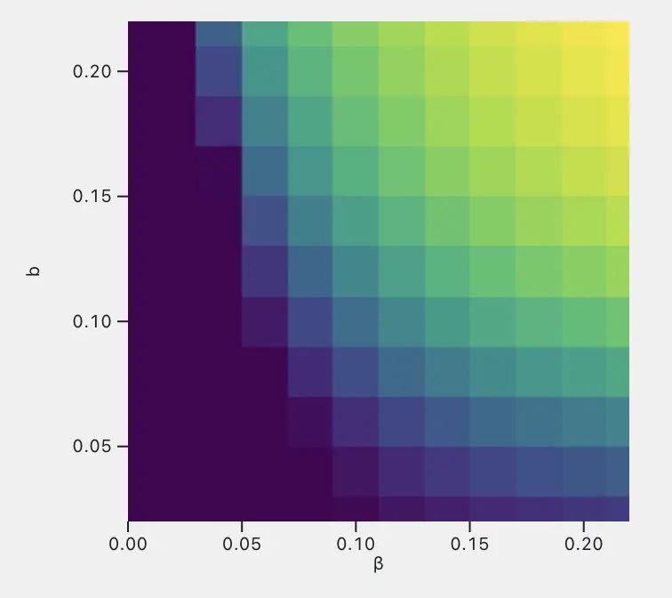
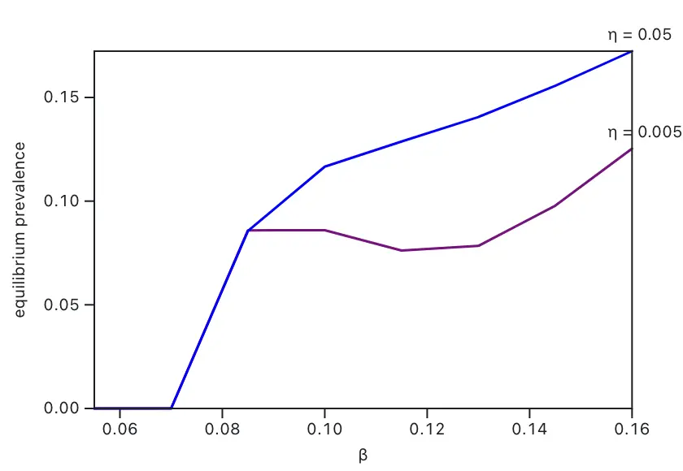
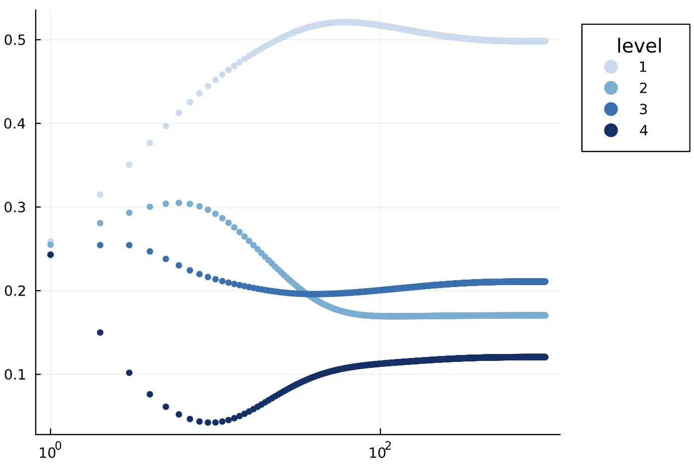

  <h1>Hello Group-based modeling</h1>
  <h2>We study how group-based models impact how we think about all sorts of contagion.</h2>
  <a href="https://mocs.observablehq.cloud/mocs-fall-2024/getting-started" target="_blank">Get started→</a>

    <a href="https://joint-lab.observablehq.cloud/hello-gmes/models/source-sink" target="_blank">
    <picture>
        <source srcset="./assets/inst-localization.webp" media="(prefers-color-scheme: dark)">
        
    </picture>
    
💡 Source-sink

    </a>
    <a href="https://joint-lab.observablehq.cloud/hello-gmes/models/call-for-action" target="_blank">
    <picture>
        <source srcset="./assets/call-for-action.webp" media="(prefers-color-scheme: dark)">
        
    </picture>
    
💡 Call for action

    </a>
    <a href="https://joint-lab.observablehq.cloud/hello-gmes/models/model-3" target="_blank">
    <picture>
        <source srcset="./assets/model-3.webp" media="(prefers-color-scheme: dark)">
        
    </picture>
    
💡 Model 3 (WIP)

    </a>

