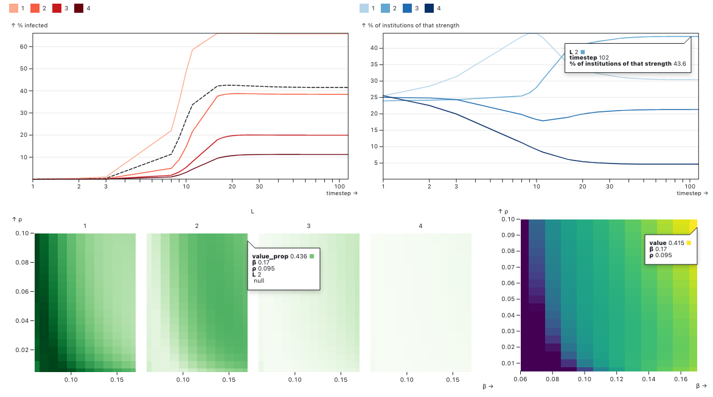

# Paradoxes in the co-evolution of contagions and institutions
## Exploring the co-evolutionary dynamics between epidemic spreading and institutional adaptation ([J. St-Onge, G. Burgio, _et al_, 2024](https://arxiv.org/abs/2310.03672)).

<!-- DASHBOARD 1 -->

```js
import { plot_time_evo } from "../components/time_evo.js";
import { plot_phase_diagram_facetted } from "../components/phase_diagram_facetted.js";
import { phase_diagram } from "../components/phase_diagram.js";
import { get_param_table, global_hm, get_data_heatmap, f, minmax, s } from "../components/helpers.js";
```

<div>
  <div class="card">
    <div class="grid grid-cols-3">
      <div>Control the axis of the phase diagrams:<br><br>${radioInput}<br><br><i>Note: μ is fixed at 0.0001. Pale asterisks indicate retained data point. See warning for details. </i></div>
      <div>${ax_formInput}</div>
      <div>${fp_formInput}</div>
    </div>
    <div class="grid grid-cols-2">
      <div>${resize((width) => plot_time_evo(time_evo_data, false, { width,  yaxis: "% infected" }))}</div>
      <div>${resize((width) => plot_time_evo(time_evo_data, true, { width }))}</div>
    </div>
    <div class="grid grid-cols-3">
      <div class="grid-colspan-2">${resize((width) => plot_phase_diagram_facetted(data_hm2, radio, { width }))}</div>
      <div class="grid-colspan-1">${resize((width) => phase_diagram(data_hm2, radio, { width }))}</div>
    </div>
  </div>
</div>

<div class="warning" label="⚠️ Warning">The visualization may give slightly different results than our paper. To keep the visualization lightweight, we sparsified the raw output with  <a href="https://github.com/jstonge/hello-gmes/blob/main/.sparsify.py#L5-L9">.sparsify.py#L5-L9</a>. That is, we throw away points where the absolute difference between two time steps is  less than 0.00001. This lead to premature termination of runs and more rough results. That said, the results should be  qualitatively the same in the paper. If not, please let us know. Also, in the paper we use different initial conditions to demonstrate different mechanisms, which we didn't reproduce here. Finally, note that if the range input is disabled or a parameter is missing, is that we didn't run the parameter sweep with this set of values. If you want to run the app with raw data, follow the following <a href="https://github.com/jstonge/hello-gmes/blob/main/README.md#instruction-to-run-data-app-with-raw-data">instructions</a>.</div>
</div>

## Decomposing the call for action

Reducing the copying rate enough, we observe the prevalence curve becoming non-monotonic, with multiple local minima. As we increase ${tex`\beta_0`} (or ${tex`\rho`}, when enough above the epidemic threshold), stronger institutions prove their ability to control the contagion, being increasingly selected.

<div>
  <div>
  <div class="grid grid-cols-2">
    <div>${selectInput}${ax2_formInput}</div>
    <div>${fp2_formInput}</div>
    </div>
    <div class="grid grid-cols-3">
      <div>${resize((width) => 
        Plot.plot({
          width,
          height: 275,
          marginBottom: 35,
          marginLeft: 20,
          marks: [
            Plot.ruleY([0]),
            Plot.axisY({ labelAnchor: "center", label: "equilibrium prevalence", labelOffset:50, tickSpacing: 80, labelArrow: "none" }),
            Plot.axisX({ labelAnchor: "center", label: select, tickSpacing: 80, labelArrow: "none" }),
            Plot.lineY(global_hm(data_hm2b).filter(d => d.param2 == 0.005), {
              x: "param1", y: "value", sort: "param1", stroke: "purple", 
              title: d => `η = 0.005`, 
              tip: true 
            }),
            Plot.text(global_hm(data_hm2b).filter(d => d.param2 == 0.005), Plot.selectLast({
              x: "param1", y: "value", sort: "param1", text:d=>`η = ${d.param2}`,
              textAnchor: "start", dx: -15, dy: -10, 
            })),
            Plot.lineY(global_hm(data_hm2b).filter(d => d.param2 == 0.05), { 
              x: "param1", y: "value", sort: "param1", stroke: "blue", 
              title: d => `η = 0.05`, tip: true 
            }),
            Plot.text(global_hm(data_hm2b).filter(d => d.param2 == 0.05), Plot.selectLast({
              x: "param1", y: "value", sort: "param1", text:d=>`η = ${d.param2}`,
              textAnchor: "start", dx: -15, dy: -10
            })),
            Plot.frame()
          ]
        }))
      }</div>
      <div>${resize((width) => call4action(0.005, "purples", { width }))}</div>
      <div>${resize((width) => call4action(0.05, "blues", { width }))}</div>
    </div>
  </div>
  <br>
</div>

## How do I interpret the quadrant?

Consider the following




- The upper left quadrant represents the time evolution of the average number of people infected by institution level. The dotted line is the global average, here converging to about 41% of people being infected.
- The upper right quadrant is the proportion of institutions of that strength. We see that 43.6% of institutions converged onto level two. Institutions weren't willing to pay the cost and invest stronger institutions than level4 in this case.
- The bottom left figure is basically the same plot than upper right, but this is a phase diagram to know how institutional proportional change as a function of relevant parameters in the model, here rho and beta. We can see the phenomenon of what we call **parameter localization**, where some institutional regimes take over part of the parameter space.
- Finally, bottom right figure is the equivalent for the upper left figure, i.e. the global average of infectedpeople over all regimes. This figure let us see how did the institutions perform for any combination of theparameter on the axes.

```js
function call4action(eta, scheme, {width = {}}) {
  return Plot.plot({
  height: 275,
  width,
  color: { type: "ordinal", scheme: scheme, range: [0.4, 1]},
  marginBottom: 35,
  marginLeft: 20,
  marks: [
    Plot.axisY({ labelAnchor: "center", label: null, tickSpacing: 80, labelArrow: "none" }),
    Plot.axisX({ labelAnchor: "center", label: select, tickSpacing: 80, labelArrow: "none" }),
    Plot.lineY(data_hm2b.filter(d => d.param2 == eta), {
      x: "param1", y: "value", sort: "param1", stroke: "L", 
      tip: true 
    }),
    Plot.lineY(global_hm(data_hm2b).filter(d => d.param2 == eta), {
      x: "param1", y: "value", sort: "param1", stroke: "black", 
      strokeDasharray: "5,3"
    }),
    Plot.frame(),
    Plot.text([`η = ${eta}`], {lineWidth: 30, frameAnchor: "middle", dy: -100, fontSize: 15})
  ]
})
}
```

<!-- IMPORT DATA -->

```js
// We first create a lookup table to map index to parameter name
const lookup2 = {}
lookup2['idx2name'] = {0: 'β', 1: 'ξ', 2: 'α', 3: 'γ', 4: 'ρ', 5: 'η', 6: 'b', 7: 'c'}
lookup2['name2idx'] = {'β': 0, 'ξ': 1, 'α': 2, 'γ': 3, 'ρ': 4, 'η': 5, 'b': 6, 'c': 7}
```

```js
const p2 = get_param_table(sourcesink2_lookup_map, lookup2)
const fy2 = "α"  // choose the facet variable
const fp2 = ["ξ", "α", "γ", "b", "c"]
const ax_vars2 = ["β", "ρ", "η"] // choose the x,y,z axis, i.e. params to vary
```

<!-- Load lookup to filter main data -->

```sql id=[...sourcesink2_lookup] 
SELECT param_str::STRING as name, row_id FROM sourcesink_lookup
```

```js
const sourcesink2_lookup_map = sourcesink2_lookup.reduce(function(map, obj) {
    map[obj.name] = obj.row_id;
    return map;
}, {})
```

```js
const param_str = `${f(ax_form['ax0'])}_${f(fp_form['fp0'])}_${f(fp_form['fp1'])}_${f(fp_form['fp2'])}_${f(ax_form['ax1'])}_${f(ax_form['ax2'])}_${f(fp_form['fp3'])}_${f(fp_form['fp4'])}_0.0001`
const chosen_row_id = sourcesink2_lookup_map[param_str]
```

<!-- filter data time evo plot  -->

```sql id=[...time_evo_data]
SELECT timestep::INT as timestep, L::INT as L, value, value_prop
FROM sourcesink
WHERE
row_id = ${chosen_row_id}
```

<!-- Load heatmap data -->

```sql id=[...phase_diagram_data]
WITH tmp as (
    SELECT row_id, L, MAX(timestep::INT) as timestep
    FROM sourcesink
    GROUP BY row_id, L
)
SELECT s.value, s.L::INT as L, s.value_prop, ss.param_str::STRING as name
FROM sourcesink s
JOIN tmp
ON s.row_id = tmp.row_id AND s.L = tmp.L AND s.timestep = tmp.timestep
JOIN sourcesink_lookup ss
ON s.row_id = ss.row_id
ORDER BY (s.row_id, s.L)
```

```js
// Heatmap-related data
const data_hm2 = get_data_heatmap(phase_diagram_data, lookup2, fp2, ax_vars2, radio, ax_form, fp_form)
const data_hm2b = get_data_heatmap(phase_diagram_data, lookup2, fp2, ax_vars2, radiob, ax2_form, fp2_form)
```


<!-- FORM-RELATED LOGIC -->

<!-- DASHBOARD 1 -->

```js
// We first need to specify x- and y-axis. Other inputs are conditional on them.
const radioInput = Inputs.form({
  x: Inputs.radio(ax_vars2, {label: "x-axis", value: ax_vars2[0]}),
  y: Inputs.radio(ax_vars2, {label: "y-axis", value: ax_vars2[1]})
})

const radio =  Generators.input(radioInput);

// p2: param table
const ax_formInput = Inputs.form({
  ax0: Inputs.range(p2[ax_vars2[0]]['minmax'], {step: p2[ax_vars2[0]]['s'], label: `${ax_vars2[0]} (Spreading rate)`, value: .16, width: 190}),
  ax1: Inputs.range(p2[ax_vars2[1]]['minmax'], {step: p2[ax_vars2[1]]['s'], label: `${ax_vars2[1]} (Between group spread)`, width: 190}),
  ax2: Inputs.range(p2[ax_vars2[2]]['minmax'], {step: p2[ax_vars2[2]]['s'], label: `${ax_vars2[2]} (Copying rate)`, width: 190})
})

const fp_formInput = Inputs.form({
  fp0: Inputs.range(p2[fp2[0]]['minmax'], {step: p2[fp2[0]]['s'], label: `${fp2[0]} (Simple-complex)`, value: p2[fp2[0]]['first_val'], width: 190}),
  fp1: Inputs.range(p2[fp2[1]]['minmax'], {step: p2[fp2[1]]['s'], label: `${fp2[1]} (Neg. benefits)`, value: p2[fp2[1]]['first_val'], width: 190}),
  fp2: Inputs.range(p2[fp2[2]]['minmax'], {step: p2[fp2[2]]['s'], label: `${fp2[2]} (Recovery rate)`, value: p2[fp2[2]]['first_val'], width: 190}),
  fp3: Inputs.range(p2[fp2[3]]['minmax'], {step: p2[fp2[3]]['s'], label: `${fp2[3]} (Group benefits)`, value: -1, width: 190}),
  fp4: Inputs.range(p2[fp2[4]]['minmax'], {step: p2[fp2[4]]['s'], label: `${fp2[4]} (Inst. Cost)`, value: p2[fp2[4]]['first_val'], width: 190})
})

const ax_form = Generators.input(ax_formInput)
const fp_form = Generators.input(fp_formInput)
```

<!-- DASHBOARD 2 -->

```js
const selectInput = Inputs.select(["ρ", "β"], {label: "x-axis", value: "β"})
const select = Generators.input(selectInput)

const ax2_formInput = Inputs.form({
  ax0: Inputs.range(p2[ax_vars2[0]]['minmax'], {step: p2[ax_vars2[0]]['s'], label: `${ax_vars2[0]} (Spreading rate)`, disabled: select == "ρ" ? false : true}),
  ax1: Inputs.range(p2[ax_vars2[1]]['minmax'], {step: p2[ax_vars2[1]]['s'], label: `${ax_vars2[1]}`, disabled: select == "ρ" ? true : false}),
  ax2: Inputs.range(p2[ax_vars2[2]]['minmax'], {step: p2[ax_vars2[2]]['s'], label: ax_vars2[2], disabled: true}),
})

const fp2_formInput = Inputs.form({
  fp0: Inputs.range(p2[fp2[0]]['minmax'], {step: p2[fp2[0]]['s'], label: fp2[0], value: p2[fp2[0]]['first_val'], disabled: true}),
  fp1: Inputs.range(p2[fp2[1]]['minmax'], {step: p2[fp2[1]]['s'], label: fp2[1], value: p2[fp2[1]['first_val']]['first_val'], disabled: true}),
  fp2: Inputs.range(p2[fp2[2]]['minmax'], {step: p2[fp2[2]]['s'], label: fp2[2], value: p2[fp2[2]]['first_val'], disabled: true}),
  fp3: Inputs.range(p2[fp2[3]]['minmax'], {step: p2[fp2[3]]['s'], label: fp2[3], value: -1}),
  fp4: Inputs.range(p2[fp2[4]]['minmax'], {step: p2[fp2[4]]['s'], label: fp2[4], value: p2[fp2[4]]['first_val'], disabled: true}),
})

const ax2_form = Generators.input(ax2_formInput)
const fp2_form = Generators.input(fp2_formInput)
```

```js
const radiob = { x: select, y: "η" }
```

<!-- DASHBOARD Call for action -->

```js
const ax3_formInput = Inputs.form({
  ax0: Inputs.range(p2[ax_vars2[0]]['minmax'], {step: p2[ax_vars2[0]]['s'], label: `${ax_vars2[0]} (Spreading rate)`}),
  ax1: Inputs.range(p2[ax_vars2[1]]['minmax'], {step: p2[ax_vars2[1]]['s'], label: `${ax_vars2[1]}`}),
  ax2: Inputs.range(p2[ax_vars2[2]]['minmax'], {step: p2[ax_vars2[2]]['s'], label: ax_vars2[2], disabled: true})
})

const fp3_formInput = Inputs.form({
  fp0: Inputs.range(p2[fp2[0]]['minmax'], {step: p2[fp2[0]]['s'], label: fp2[0], value: p2[fp2[0]]['first_val'], disabled: true}),
  fp1: Inputs.range(p2[fy2]['minmax'], {step: p2[fy2]['s'], label: fy2, value: p2[fy2]['first_val'], disabled: true}),
  fp2: Inputs.range(p2[fp2[2]]['minmax'], {step: p2[fp2[2]]['s'], label: fp2[2], value: p2[fp2[2]]['first_val'], disabled: true}),
  fp3: Inputs.range(p2[fp2[3]]['minmax'], {step: p2[fp2[3]]['s'], label: fp2[3], value: p2[fp2[3]]['first_val']}),
  fp4: Inputs.range(p2[fp2[4]]['minmax'], {step: p2[fp2[4]]['s'], label: fp2[4], value: p2[fp2[4]]['first_val'], disabled: true})
})

const ax3_form = Generators.input(ax3_formInput)
const fp3_form = Generators.input(fp3_formInput)
```

```js
const radioc = {x:"β", y: "η"}
```


<style>
.warning {
    display: block;  /* Ensures it behaves like a block element */
    width: 100%;     /* Makes it take the full width of the parent */
    max-width: 100vw; /* Prevents it from exceeding viewport width */
}
</style>