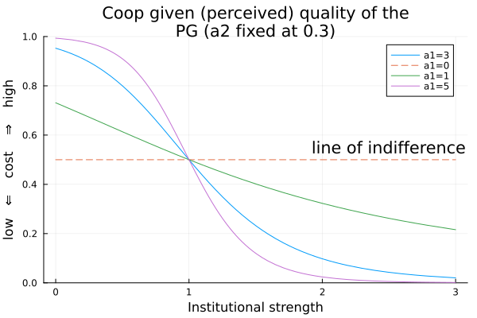

# Model 3
## In which we add individuals the ability to disagree with the groups

```js
import { plot_time_evo } from "../components/time_evo.js";
import { plot_phase_diagram_facetted } from "../components/phase_diagram_facetted.js";
import { phase_diagram } from "../components/phase_diagram.js";
import { get_param_table, global_hm, get_data_heatmap, f, minmax, s } from "../components/helpers.js";
```

<div>
  <div class="card">
    <div class="grid grid-cols-3">
      <div>Control the axis of the phase diagrams:<br><br>${radioInput}<br><br><i>Note: b and c are fixed. Don't bother with δ either. Pale asterisks indicate retained data point. See warning for details. </i></div>
      <div>${ax_formInput}</div>
      <div>${fp_formInput}</div>
    </div>
    <div class="grid grid-cols-2">
      <div>${resize((width) => plot_time_evo(time_evo_data, false, { width,  yaxis: "% cooperators" }))}</div>
      <div>${resize((width) => plot_time_evo(time_evo_data, true, { width }))}</div>
    </div>
    <div class="grid grid-cols-3">
      <div class="grid-colspan-2">${resize((width) => plot_phase_diagram_facetted(data_hm, radio, { width }))}</div>
      <div class="grid-colspan-1">${resize((width) => phase_diagram(data_hm, radio, { width, tiplab: "cooperation" }))}</div>
    </div>
  </div>
</div>

<div class="warning" label="⚠️ Warning">To keep the visualization light, we "sparsified" the raw output with  <a href="https://github.com/jstonge/hello-gmes/blob/main/.sparsify.py#L5-L9">.sparsify.py#L5-L9</a>. That is, we throw away points where the absolute difference between two time steps is  less than 0.00001. This lead to premature termination of runs and more rough results. That said, the results are  qualitatively the same than with raw data. If you want to run the app with raw data, follow the following <a href="https://github.com/jstonge/hello-gmes/blob/main/README.md#instruction-to-run-data-app-with-raw-data">instructions</a>.</div>


<!-- IMPORT DATA -->

```js
// We first create a lookup table to map index to parameter name
const lookup = {}
lookup['idx2name'] = {0: 'β', 1: 'γ', 2: 'ρ', 3: 'b', 4: 'c', 5: 'μ', 6: 'δ', 7: 'α'}
lookup['name2idx'] = {'β': 0, 'γ': 1, 'ρ': 2, 'b': 3, 'c': 4,  'μ':5, 'δ':6, 'α':7}
```

```js
const p1 = get_param_table(sourcesink_lookup_map, lookup)
const ax_vars = ["μ", "β", "ρ"] // choose the x,y,z axis, i.e. params to vary
const fp1 = ["b", "c", "α", "δ", "γ"]
```

<!-- Load lookup to filter main data -->

```sql id=[...sourcesink_lookup] 
SELECT param_str::STRING as name, row_id FROM sourcesink_lookup
```

```js
const sourcesink_lookup_map = sourcesink_lookup.reduce(function(map, obj) {
    map[obj.name] = obj.row_id;
    return map;
}, {})
```

```js
const param_str = `${f(ax_form['ax1'])}_${f(fp_form['fp4'])}_${f(ax_form['ax2'])}_${f(fp_form['fp0'])}_${f(fp_form['fp1'])}_${f(ax_form['ax0'])}_${f(fp_form['fp3'])}_${f(fp_form['fp2'])}`
const chosen_row_id = sourcesink_lookup_map[param_str]
```

<!-- filter data time evo plot  -->

```sql id=[...time_evo_data]
SELECT timestep::INT as timestep, L::INT as L, value, value_prop
FROM sourcesink
WHERE
row_id = ${chosen_row_id}
```

<!-- Load heatmap data -->

```sql id=[...phase_diagram_data]
WITH tmp as (
    SELECT row_id, L, MAX(timestep::INT) as timestep
    FROM sourcesink
    GROUP BY row_id, L
)
SELECT s.value, s.L::INT as L, s.value_prop, ss.param_str::STRING as name
FROM sourcesink s
JOIN tmp
ON s.row_id = tmp.row_id AND s.L = tmp.L AND s.timestep = tmp.timestep
JOIN sourcesink_lookup ss
ON s.row_id = ss.row_id
ORDER BY (s.row_id, s.L)
```

```js
// Heatmap-related data
const data_hm = get_data_heatmap(phase_diagram_data, lookup, fp1, ax_vars, radio, ax_form, fp_form)
```

<!-- FORM-RELATED LOGIC -->

```js
// We first need to specify x- and y-axis. Other inputs are conditional on them.
const radioInput = Inputs.form({
  x: Inputs.radio(ax_vars, {label: "x-axis", value: ax_vars[0]}),
  y: Inputs.radio(ax_vars, {label: "y-axis", value: ax_vars[1]})
})

const radio =  Generators.input(radioInput);

const ax_formInput = Inputs.form({
  ax0: Inputs.range(p1[ax_vars[0]]['minmax'], {step: p1[ax_vars[0]]['s'], label: `${ax_vars[0]} (endogenous inst. change)`}),
  ax1: Inputs.range(p1[ax_vars[1]]['minmax'], {step: p1[ax_vars[1]]['s'], label: `${ax_vars[1]} (endogenous rate of ind. changey)`}),
  ax2: Inputs.range(p1[ax_vars[2]]['minmax'], {step: p1[ax_vars[2]]['s'], label: `${ax_vars[2]} (Global behavioral)`}),
})

const fp_formInput = Inputs.form({
  fp0: Inputs.range(p1[fp1[0]]['minmax'], {step: p1[fp1[0]]['s'], label: `${fp1[0]} (Group benefits)`, value: p1[fp1[0]]['first_val']}),
  fp1: Inputs.range(p1[fp1[1]]['minmax'], {step: p1[fp1[1]]['s'], label: `${fp1[1]} (Inst. cost)`, disabled: true, value: p1[fp1[1]]['first_val']}),
  fp2: Inputs.range(p1[fp1[2]]['minmax'], {step: p1[fp1[2]]['s'], label: `${fp1[2]} (Imitation rate)`, value: p1[fp1[2]]['first_val']}),
  fp3: Inputs.range(p1[fp1[3]]['minmax'], {step: p1[fp1[3]]['s'], label: fp1[3], disabled: true, value: p1[fp1[3]]['first_val']}),
  fp4: Inputs.range(p1[fp1[4]]['minmax'], {step: p1[fp1[4]]['s'], label: `${fp1[4]} (Recovery)`, value: p1[fp1[4]]['first_val']})
})

const ax_form = Generators.input(ax_formInput)
const fp_form = Generators.input(fp_formInput)
```

---


## Math version

Individuals have opinions about how their institution manages their public goods. For illustration's sake, we assume that the abstract potential dependency on the current state on the group now takes the form of allocating resources to scale up institutions. The first set of transition rates 
    
```tex
\begin{align*}
    \frac{d}{dt}M_{n,i}^\ell =&~ (n-i+1)\left[ \textcolor{red}{f}(\textcolor{purple}{s}(\ell) - 1) + \beta(i-1) + \rho \beta \phi \right]G_{i-1,\ell} \\
                    &- (n-i)\left[ \textcolor{red}{f}(\textcolor{purple}{s}(\ell) - 1) + \beta i + \rho \beta \phi \right] G_{i-1,\ell} \\
                    &+ (i+1) \left[ \textcolor{red}{f}(1 - \textcolor{purple}{s}(\ell)) + \gamma(n-i-1) \rho \gamma(n - \phi) \right] G_{i+1,\ell} \\
                    &- i\left[ \textcolor{red}{f}(1 - \textcolor{purple}{s}(\ell)) + \gamma(n-i) + \rho \gamma (n-\phi) \right] G_{i,\ell}
\end{align*} 
```

where _i_ is the number of cooperators, _n_ is group size, ϕ represents the influence of other groups on individual activation. And that

```tex
\phi = \sum_{i,\ell} i G_{i,\ell}
```
The function ${tex`\textcolor{red}{f}`} captures individual incentives to cooperate as the sigmoid function, where it is assumed that stronger institutions reduce the cost of cooperation. The function ${tex`\textcolor{purple}{s}`} models the perceived quality of the public good as a function of the institutional level. The overall dynamics allows us to explore how cooperation depends on the perceived quality of the public good as a function of institutional strength. Concretely, we have

```tex
\quad\quad\quad \textcolor{red}{f(x) = \frac{1}{1 + e^{-\alpha x}}}  \quad\quad\quad \textcolor{purple}{s(\ell) = \frac{1 - e^{-\alpha \ell}}{1 - e^{-\alpha}}}  \quad\quad\quad h(x) = e^{-\alpha x}
```

For a given set of params, function ${tex`\textcolor{red}{f}`} looks like:

<picture>
        <source srcset="../assets/test.png" media="(prefers-color-scheme: dark)">
        
</picture>

Also, we assume that the functions respect

```tex
\quad\quad\quad \textcolor{purple}{s(\ell) : \frac{ds}{d\ell} > 0} ; \quad\quad\quad \textcolor{red}{f(x): \frac{df}{dx} > 0} , \quad\quad\quad \textcolor{red}{f(0) = 1/2} , \quad\quad\quad \textcolor{red}{g(x): \frac{dg}{dx} > 0} , \quad\quad\quad \textcolor{red}{g(0) = 1/2}
```

That is, ${tex`\textcolor{red}{f(0)}`} and ${tex`\textcolor{red}{g(0)}`} indicate individual indifference with respect to group strategy.  The second set of transition rates includes resource requirement to upgrade institution, which here we assume to also take a sigmoid form:

```tex
\begin{align}
    \notag \frac{d}{dt}E_{n,i}^\ell =&~ \textcolor{red}{g}(bi - c\ell) \left[\mu + \rho \dfrac{Z^{\ell}_{n,i}}{Z^{\ell-1}_{n,i}}\right]G_{n,i}^{\ell-1} 
        - \textcolor{red}{g}(bi - c(\ell+1)) \left[\mu + \rho \dfrac{Z^{\ell+1}_{n,i}}{Z^{\ell}_{n,i}}\right]G_{n,i}^{\ell} \\ 
        \notag &+  \left[ \mu \textcolor{red}{g}(c(\ell+1) - bi) + \rho  \textcolor{red}{g}(bi - c\ell) \dfrac{Z^{\ell}_{n,i}}{Z^{\ell+1}_{n,i}}\right] G_{n,i}^{\ell+1}  - 
        \left[ \mu \textcolor{red}{g}(c\ell - bi) + \rho \textcolor{red}{g}(bi - c(\ell-1)) \dfrac{Z^{\ell - 1}_{n,i}}{Z^{\ell}_{n,i}} \right] G_{n,i}^{\ell} \; 
\end{align} 
```

The fitness function take the form

```tex
Z_{\ell} = \frac{\sum_{i} G_{i,\ell}\ \textcolor{red}{\tilde{g}} (bi-c\ell)}{\sum_{i} G_{i,\ell}}
```

note that  ${tex`\textcolor{red}{g}`} (fitness function) and ${tex`\textcolor{red}{\tilde{g}}`} (cost-benefits for groups) are taken to be equal to function ${tex`\textcolor{red}{f}`} (they share the same properties).

## Why is it interesting?

In the [previous model](./call-for-action.md), we explored how the copying rate of institutions, ${tex`\eta`}, was able to separate the timescale of information and contagion. Here, we are interested in how playing with the of  ${tex`\mu`} means that groups change their institutions more independently and less because of imitating others. By look at the ${tex`\mu`}/${tex`\rho`}, we can have a better idea of how the ratio of endogenous institutional influence to exogeneous on the group influence cooperation. 

<style>
.warning {
    display: block;  /* Ensures it behaves like a block element */
    width: 100%;     /* Makes it take the full width of the parent */
    max-width: 100vw; /* Prevents it from exceeding viewport width */
}

img {
  margin-top: 1rem;
  margin-bottom: 1rem;
  border-radius: 8px;
  box-shadow: 0 0 0 0.75px rgba(128, 128, 128, 0.2), 0 6px 12px 0 rgba(0, 0, 0, 0.2);
}

</style>