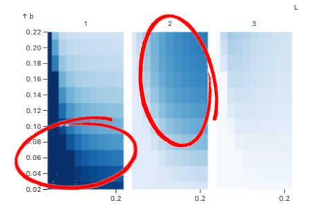
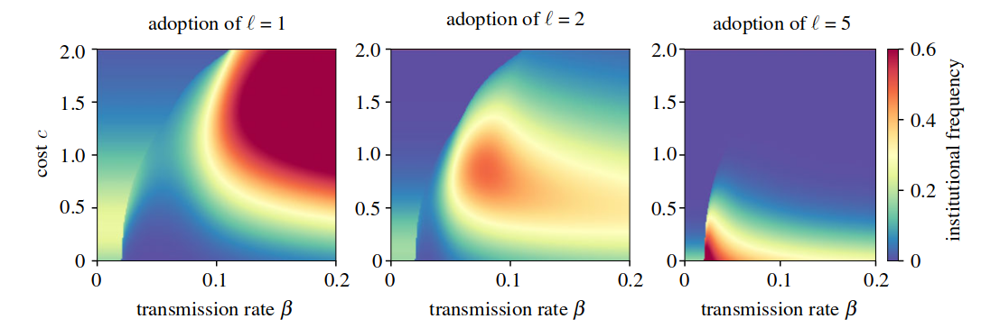

# A group-based approach to model behavior and institution co-evolution
## [Source-sink behavioural dynamics limit institutional evolution in a group-structured society (Hébert-Dufresne, Waring, et al 2022)](https://royalsocietypublishing.org/doi/10.1098/rsos.211743)

<!-- DASHBOARD 1 -->

```js
import { plot_time_evo } from "./components/time_evo.js";
import { plot_phase_diagram_facetted } from "./components/phase_diagram_facetted.js";
import { phase_diagram } from "./components/phase_diagram.js";
import { get_param_table, global_hm, get_data_heatmap, f, minmax, s } from "./components/helpers.js";
```

<div>
  <div class="card">
    <div class="grid grid-cols-3">
      <div>Control the axis of the phase diagrams (see below for parameter definition): ${radioInput}</div>
      <div>${ax_formInput}</div>
      <div>${fp_formInput}</div>
    </div>
    <div class="grid grid-cols-2">
      <div>${resize((width) => plot_time_evo(time_evo_data, false, { width }))}</div>
      <div>${resize((width) => plot_time_evo(time_evo_data, true, { width }))}</div>
    </div>
    <div class="grid grid-cols-3">
      <div class="grid-colspan-2">${resize((width) => plot_phase_diagram_facetted(data_hm, radio, { width }))}</div>
      <div class="grid-colspan-1">${resize((width) => phase_diagram(data_hm, radio, { width }))}</div>
    </div>
  </div>
</div>

#### Things to try
 - Try maxing out behavioral transmission rate within group while reducing institutional cost. This is the only time it is worth investing in very strong institutions!

#### Analysis

_Institutional localization_: In some regime, we can see that some institutional levels dominate phase space. The faceted figure on the bottom corresponds to  **Figure 5** in the paper. 





<!-- IMPORT DATA -->

```js
// We first create a lookup table to map index to parameter name
const lookup = {}
lookup['idx2name'] = {0: "β", 1: 'γ', 2: 'ρ', 3: 'b', 4: 'c', 5: 'μ'}
lookup['name2idx'] = {"β": 0, 'γ': 1, 'ρ': 2, 'b': 3, 'c': 4, 'μ': 5}
```

```js
const p1 = get_param_table(sourcesink_lookup_map, lookup)
const ax_vars = ["β", "b", "c"]
const fp1 = ["γ", "ρ", "μ"]
```

<!-- Load lookup to filter main data -->

```sql id=[...sourcesink_lookup] 
SELECT param_str::STRING as name, row_id FROM sourcesink_lookup
```

```js
const sourcesink_lookup_map = sourcesink_lookup.reduce(function(map, obj) {
    map[obj.name] = obj.row_id;
    return map;
}, {})
```

```js
const chosen_row_id = sourcesink_lookup_map[`${f(ax_form['ax0'])}_${f(fp_form['fp0'])}_${f(fp_form['fp1'])}_${f(ax_form['ax1'])}_${f(ax_form['ax2'])}_${f(fp_form['fp2'])}`]
```

<!-- filter data time evo plot  -->

```sql id=[...time_evo_data]
SELECT timestep::INT as timestep, L::INT as L, value, value_prop
FROM sourcesink
WHERE
row_id = ${chosen_row_id}
```

<!-- Load heatmap data -->

```sql id=[...phase_diagram_data]
WITH tmp as (
    SELECT row_id, L, MAX(timestep::INT) as timestep
    FROM sourcesink
    GROUP BY row_id, L
)
SELECT s.value, s.L::INT as L, s.value_prop, ss.param_str::STRING as name
FROM sourcesink s
JOIN tmp
ON s.row_id = tmp.row_id AND s.L = tmp.L AND s.timestep = tmp.timestep
JOIN sourcesink_lookup ss
ON s.row_id = ss.row_id
ORDER BY (s.row_id, s.L)
```

```js
// Heatmap-related data
const data_hm = get_data_heatmap(phase_diagram_data, lookup, fp1, ax_vars, radio, ax_form, fp_form)
```

<!-- FORM-RELATED LOGIC -->

```js
// We first need to specify x- and y-axis. Other inputs are conditional on them.
const radioInput = Inputs.form({
  x: Inputs.radio(ax_vars, {label: "x-axis", value: ax_vars[0]}),
  y: Inputs.radio(ax_vars, {label: "y-axis", value: ax_vars[1]})
})

const radio =  Generators.input(radioInput);

const ax_formInput = Inputs.form({
  ax0: Inputs.range(p1[ax_vars[0]]['minmax'], {step: p1[ax_vars[0]]['s'], label: `${ax_vars[0]} (Spreading rate)`}),
  ax1: Inputs.range(p1[ax_vars[1]]['minmax'], {step: p1[ax_vars[1]]['s'], label: `${ax_vars[1]} (Group benefits)`}),
  ax2: Inputs.range(p1[ax_vars[2]]['minmax'], {step: p1[ax_vars[2]]['s'], label: `${ax_vars[2]} (Institutional cost)`}),
})

const fp_formInput = Inputs.form({
  fp0: Inputs.range(p1[fp1[0]]['minmax'], {step: p1[fp1[0]]['s'], label: `${fp1[0]} (Recovery rate)`, value: p1[fp1[0]]
  ['first_val']}),
  fp1: Inputs.range(p1[fp1[1]]['minmax'], {step: p1[fp1[1]]['s'], label: `${fp1[1]} (Behav. diffusion)`, value: p1[fp1[1]]
  ['first_val']}),
  fp2: Inputs.range(p1[fp1[2]]['minmax'], {step: p1[fp1[2]]['s'], label: fp1[2], value: p1[fp1[2]]['first_val']})
})

const ax_form = Generators.input(ax_formInput)
const fp_form = Generators.input(fp_formInput)
```


